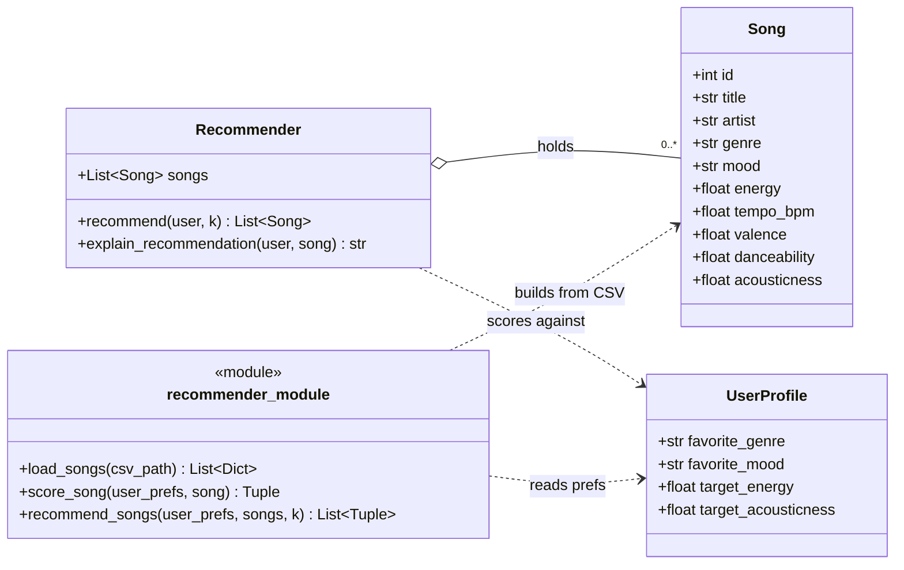

# Content-Based Filtering — Data Types & Limitations

## Main Data Types (the features each Song is described by)

Content-based filtering matches items by their **attributes**. These attributes fall into three data types:

### Categorical (text labels)
- **genre** — e.g. pop, lofi, rock, jazz, ambient
- **mood** — e.g. happy, chill, intense, relaxed, focused
- **artist** — used to match "more from artists you like"

### Numeric (continuous values, usually 0.0–1.0 or a real scale)
- **energy** — how intense/active the track feels (0.0 calm → 1.0 intense)
- **tempo_bpm** — speed in beats per minute
- **valence** — musical positivity/happiness (0.0 sad → 1.0 cheerful)
- **danceability** — how suitable for dancing
- **acousticness** — how acoustic vs. electronic (0.0 electronic → 1.0 acoustic)

## User Taste Profile (attributes matched against songs)
- **favorite_genre** — categorical
- **favorite_mood** — categorical
- **target_energy** — numeric
- **target_acousticness** — numeric 

## Limitations
- **Filter bubble** — repeated similar results narrow the user's taste over time.
- **Needs good features** — quality depends entirely on how well songs are tagged; missing or wrong attributes = bad matches.
- **No social learning** — ignores what similar users enjoy (that's collaborative filtering's strength).
- **Shallow understanding** — uses attributes only; does not understand lyrics, language, or cultural meaning.
- **Small catalog** — with less 100 songs, options run out quickly.

## UML Class Diagram



## Scoring Rule (math-based, scale 0–100)

Mood and energy are weighted highest because a listener bends genre to fit the mood/energy they want at live time. Genre therefore weighs less. Acoustic is kept at a solid weight because it is a standing preference — someone who wants acoustic wants it whether they are happy or not, energetic or not. It is now scored on a numeric 0–1 scale (closeness, like energy) rather than a yes/no flag, so the song's recommendation return could have higher change with the different genres, therefore, create a new experience for the user.

### Weights (sum to 100)

| Attribute | Weight | Why |
|-----------|:------:|-----|
| Mood      | 30 | What the listener feels like right now |
| Energy    | 30 | Physical intensity wanted (workout vs. study) |
| Genre     | 20 | Flexible; people cross genres for a mood/energy |
| Acoustic  | 20 | Standing preference, independent of mood/energy — kept as a floor |
| **Total** | **100** | Mood + Energy = 60 → they still lead |

### Formula

```
Score = 30·m + 30·e + 20·g + 20·a      (each sub-score is 0..1 → total 0..100)
```

- **m (mood)**  = 1 if the song's mood equals the user's favorite mood, else 0
- **e (energy)** = 1 − |user's target energy − song's energy|   (both on 0..1)
- **g (genre)**  = 1 if the song's genre equals the user's favorite genre, else 0
- **a (acoustic)** = 1 − |user's target acousticness − song's acousticness|   (both on 0..1)

In words: give full points when a category matches exactly (mood, genre), and
give points that shrink with distance for the numeric attributes (energy and
acoustic both use the same closeness formula).

### Worked example
User: favorite_genre=pop, favorite_mood=happy, target_energy=0.8, target_acousticness=0.2

| Song | genre | mood | energy | acoustic | m·30 | e·30 | g·20 | a·20 | Total |
|------|-------|------|:------:|:--------:|:----:|:----:|:----:|:----:|:-----:|
| Sunrise City   | pop        | happy   | 0.82 | 0.18 | 30 | 29.4 | 20 | 19.6 | **99.0** |
| Rooftop Lights | indie pop  | happy   | 0.76 | 0.35 | 30 | 28.8 | 0  | 17.0 | **75.8** |
| Gym Hero       | pop        | intense | 0.93 | 0.05 | 0  | 26.1 | 20 | 17.0 | **63.1** |

Rooftop Lights (wrong genre, right mood+energy) beats Gym Hero (right genre,
wrong mood) — confirming genre yields to mood+energy.

## Ranking Rule (turning scores into recommendations)

After every song has a 0–100 score, build the recommendation list like this:

1. **Score every song** in the catalog against the user profile.
2. **Sort** all songs by score, highest first (descending order).
3. **Break ties** with a consistent rule so results are stable — e.g. if two
   songs tie, prefer the higher energy match, then fall back to song id.
4. **Take the top k** (the first k songs after sorting) as the recommendations.
5. **Attach the reasons** for each recommended song so the system can explain
   *why* it was picked (feeds `explain_recommendation`).

Optional refinements to revise later:
- **Minimum score cutoff** — drop anything below, say, 40/100 so weak matches
  never appear even if the catalog is small.
- **Diversity** — avoid returning k songs by the same artist or genre so the
  list feels varied instead of repetitive.

### Tuning notes (to revise later)
- Weights are variables, not law — try mood 35 / energy 30 / genre 20 / acoustic 15 and compare rankings (good for the README "Experiments" section).
- Optional: partial mood credit via an adjacency table (e.g. chill↔relaxed = 0.5) so a near-miss mood still beats a total mismatch.