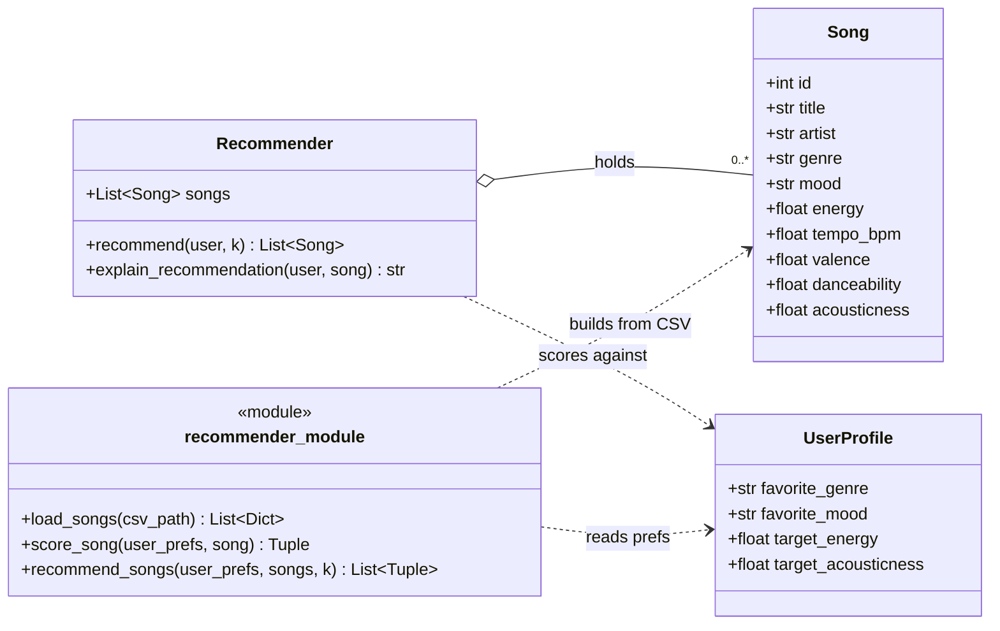

# Content-Based Filtering — Data Types & Limitations

## Main Data Types (the features each Song is described by)

Content-based filtering matches items by their **attributes**. These attributes fall into three data types:

### Categorical (text labels)
- **genre** — e.g. pop, lofi, rock, jazz, ambient
- **mood** — e.g. happy, chill, intense, relaxed, focused
- **artist** — used to match "more from artists you like"

### Numeric (continuous values, usually 0.0–1.0 or a real scale)
- **energy** — how intense/active the track feels (0.0 calm → 1.0 intense)
- **tempo_bpm** — speed in beats per minute
- **valence** — musical positivity/happiness (0.0 sad → 1.0 cheerful)
- **danceability** — how suitable for dancing
- **acousticness** — how acoustic vs. electronic (0.0 electronic → 1.0 acoustic)

## User Taste Profile (attributes matched against songs)
- **favorite_genre** — categorical
- **favorite_mood** — categorical
- **target_energy** — numeric
- **target_acousticness** — numeric 

## Limitations
- **Filter bubble** — repeated similar results narrow the user's taste over time.
- **Needs good features** — quality depends entirely on how well songs are tagged; missing or wrong attributes = bad matches.
- **No social learning** — ignores what similar users enjoy (that's collaborative filtering's strength).
- **Shallow understanding** — uses attributes only; does not understand lyrics, language, or cultural meaning.
- **Small catalog** — with less 100 songs, options run out quickly.

## UML Class Diagram



## Scoring Rule (math-based, scale 0–100)

Genre and energy are weighted highest now. Genre is the listener's clearest, most stable signal of what they want — it's the first thing worth getting right, and only after that should the system offer them a different genre based on energy and other factors. Energy is weighted equally because it's a simple, objective dial to measure (calm vs. intense), unlike mood, which is a fuzzier, more subjective read on "how someone feels right now." Mood therefore weighs less than before. Acoustic stays at the same solid weight because it is a standing preference — someone who wants acoustic wants it whether they are happy or not, energetic or not.

### Weights (sum to 100)

| Attribute | Weight | Why |
|-----------|:------:|-----|
| Genre     | 30 | The listener's clearest, most stable preference — get this right first |
| Energy    | 30 | Physical intensity wanted (workout vs. study); simpler and more objective to measure than mood |
| Mood      | 20 | What the listener feels like right now, but fuzzier/more subjective than energy |
| Acoustic  | 20 | Standing preference, independent of mood/energy — kept as a floor |
| **Total** | **100** | Genre + Energy = 60 → they now lead |

### Formula

```
Score = 20·m + 30·e + 30·g + 20·a      (each sub-score is 0..1 → total 0..100)
```

- **m (mood)**  = 1 if the song's mood equals the user's favorite mood, else 0
- **e (energy)** = 1 − |user's target energy − song's energy|   (both on 0..1)
- **g (genre)**  = 1 if the song's genre equals the user's favorite genre, else 0
- **a (acoustic)** = 1 − |user's target acousticness − song's acousticness|   (both on 0..1)

In words: give full points when a category matches exactly (mood, genre), and
give points that shrink with distance for the numeric attributes (energy and
acoustic both use the same closeness formula).

### Worked example
User: favorite_genre=pop, favorite_mood=happy, target_energy=0.8, target_acousticness=0.2

| Song | genre | mood | energy | acoustic | g·30 | e·30 | m·20 | a·20 | Total |
|------|-------|------|:------:|:--------:|:----:|:----:|:----:|:----:|:-----:|
| Sunrise City   | pop        | happy   | 0.82 | 0.18 | 30 | 29.4 | 20 | 19.6 | **99.0** |
| Gym Hero       | pop        | intense | 0.93 | 0.05 | 30 | 26.1 | 0  | 17.0 | **73.1** |
| Rooftop Lights | indie pop  | happy   | 0.76 | 0.35 | 0  | 28.8 | 20 | 17.0 | **65.8** |

Gym Hero (right genre, wrong mood) now beats Rooftop Lights (wrong genre,
right mood+energy) — confirming genre + energy now lead over mood + acoustic.

## Ranking Rule (turning scores into recommendations)

After every song has a 0–100 score, build the recommendation list like this:

1. **Score every song** in the catalog against the user profile.
2. **Sort** all songs by score, highest first (descending order).
3. **Break ties** with a consistent rule so results are stable — e.g. if two
   songs tie, prefer the higher energy match, then fall back to song id.
4. **Take the top k** (the first k songs after sorting) as the recommendations.
5. **Attach the reasons** for each recommended song so the system can explain
   *why* it was picked (feeds `explain_recommendation`).

Optional refinements to revise later:
- **Minimum score cutoff** — drop anything below, say, 40/100 so weak matches
  never appear even if the catalog is small.
- **Diversity** — avoid returning k songs by the same artist or genre so the
  list feels varied instead of repetitive.

### Tuning notes (to revise later)
- Weights are variables, not law — try mood 35 / energy 30 / genre 20 / acoustic 15 and compare rankings (good for the README "Experiments" section).
- Optional: partial mood credit via an adjacency table (e.g. chill↔relaxed = 0.5) so a near-miss mood still beats a total mismatch.

## Scoring Modes

`score_song`/`recommend_songs`/`Recommender.recommend` take a `mode` argument selecting
which weight table to score with, chosen from `SCORING_MODES` in `recommender.py`. Each
mode still spends the same 100-point pool across mood/energy/genre/acoustic — only the
split changes. `"balanced"` is the original weighting above and remains the default.
Each of the other 4 modes gives its named attribute 50 points and splits the remaining
50 evenly across the other three (50/3 ≈ 16.67 each).

| Mode | Genre | Energy | Mood | Acoustic |
|------|:-----:|:------:|:----:|:--------:|
| balanced (default) | 30 | 30 | 20 | 20 |
| genre_first | 50 | 16.67 | 16.67 | 16.67 |
| mood_first | 16.67 | 16.67 | 50 | 16.67 |
| energy_focused | 16.67 | 50 | 16.67 | 16.67 |
| acoustic_focused | 16.67 | 16.67 | 16.67 | 50 |

An unrecognized mode name raises `ValueError` rather than silently falling back to
`"balanced"`, so a typo surfaces immediately instead of quietly re-scoring under the
wrong weights.

`main.py` prompts for a mode separately before scoring each sample profile (so
different profiles in the same run can compare different modes side by side), and
prints the active mode name alongside each profile's recommendations.